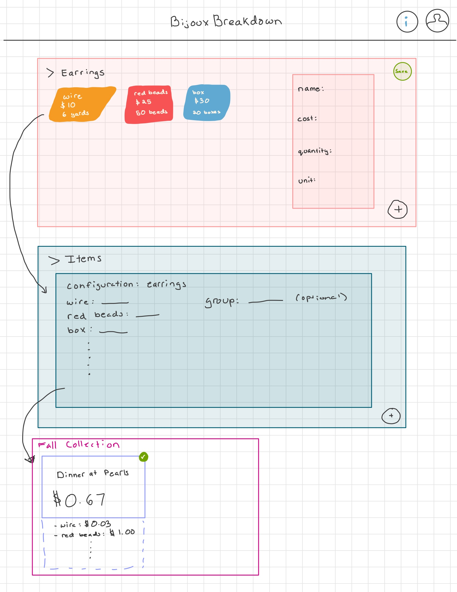

# BijouxBreakdown

10/18/2025
Basic Plan:

The UI will look like a sketchbook, and become longer as you use different functionalities. 

There will be a basic header and two basic buttons:

                                    BijouxBreakdown                     <?>  <profile>
______________________________________________________________________________________

                + Configure Supplies                + Add Items

The help icon will explain how to use the site
The only real purpose of the login is to save supply configurations and items. Both of those will be drop down options after pressing on the profile. 

Pressing "Configure Supplies" will have two options pop up: "New" or "Use Saved Configuration" which will prompt the user to login so they can access previous configurations. A user can create multiple configurations. 

Pressing "New" will launch a promt asking the user to name the configuration. The configuration will first apprear as an empty rectangle with a plus button. This plus button will launch a small square thing asking for the name of the supply, cost, quantity, and the unit of measurmeent. Upon entering, the unit of measurement will be double checked to see if we support it. 

Users could create one giant configuration with all of their supplies, or create smaller configurations more specific to their needs. For example, someone could make earrings, rings, and necklaces. All of those have different needs which is why multiple configs are needed. Should be collabsable.

After enting this information, a colorful, sighlty difigured, square will appear in the configuration rectangle. This will continue until the user continues and presses "Save"

The user can then make specific items. If the user presses "Add Items" before a configuration is saved. They will get an error message - please create and save a configuration in order to create items.

Making Items is pretty much the same thing, except the configuration is automatically loaded into the small square that is created after hitting the plus button. See example drawing below for clarity. Should be collabsable.

After the item instance appears, users will have the option to save it to the board by pinning it to their workspace, they can also delete it. The save functioniity can only happen if you log in. There will also be an option to add the item to a pre-existing group. This will spawn a item on the board which states the name of the item and the total cost of producing it. You can press on the entry to see details, and resise the item and drag it around your board. 

There will also be grouping functionality for the items. Users can create groups (undecided on how they will be able to do this) and drag and drop their items into the group, or have an item automatically added to a group. 

Diagram:

